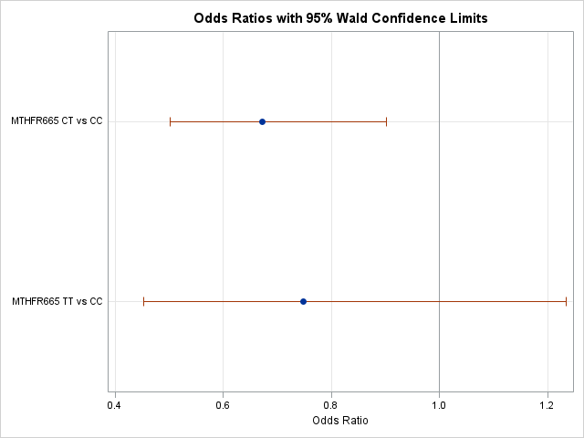

# Statistics coursework: biostatistics in SAS and chromatographic signal processing

MSc student project, Gdańsk University of Technology, 2026. Course: *Biostatistics* and *Statistical Programming*.

## Biostatistics in SAS: MTHFR 665 C>T, homocysteine and lung cancer (`biostatistics-sas/`)

Two questions:
1. Does plasma homocysteine (Hcy) differ between MTHFR 665 genotypes (CC / CT / TT)?
2. Does the genotype affect lung-cancer risk?

Workflow:
- descriptive statistics
- normality tests
- Kruskal–Wallis (or ANOVA) with post-hoc pairwise comparisons
- logistic regression with odds ratios and a contingency table

Files:
- `zadanie7_MTHFR665_Hcy.sas`: annotated SAS script
- `results_summary.md`: aggregated results (frequencies, descriptive statistics, normality tests, Kruskal–Wallis, DSCF and Mann–Whitney tests, logistic regression, odds ratios, contingency table, χ² statistics)
- `figures/`: SAS plots (histograms, box plots, odds-ratio plot)
- `presentation.pdf`: results presentation (PL)

**Data (not included, sensitive):** the case–control dataset `C1metabolismlungcancerv2.xlsx` (sheet `onetothree`, 1 056 participants). It holds individual genotypes, homocysteine levels and cancer status, so it is health data and is not published. It was provided as course material for *Biostatistics* at Gdańsk University of Technology and is available only from the course instructors.

**No individual-level participant data are distributed in this repository.** The results contain only group-level summaries and model estimates. The SAS script no longer prints example rows or extreme observations: it uses `PROC CONTENTS` instead of `PROC PRINT` and `ODS EXCLUDE ExtremeObs`. Group minima and maxima appear only inside the descriptive-statistics table.

## GC-MS chromatogram processing in MATLAB (`chromatography-signal-processing-matlab/`)

Processing of total-ion chromatograms read from netCDF (`.CDF`) files:
- normalisation
- polynomial baseline correction
- linear vs log-scale visualisation of trace components

Files:
- `zad1–5_final.m`: MATLAB scripts
- `lab4_report.pdf`: short report (PL)

**Data (public, not copied here because of size, ~1.3 GB):** *GC-MS Analysis for Apple Wine Fermentation*, University of Copenhagen Chemometrics group. Download the `.CDF` files from <https://ucphchemometrics.com/applewine/>.

## Python exercises (`python-exercises/`)

Exploratory analysis of a fluorescence olive-oil dataset (NumPy, pandas, matplotlib, scikit-learn).

**Data (public):** Venturini F. et al., *Dataset of Fluorescence Spectra and Chemical Parameters of Olive Oils*, Mendeley Data, CC BY 4.0, <https://data.mendeley.com/datasets/thkcz3h6n6/6>. The scripts expect the files in `PS_datasets/Olive Oils/`.

**Tools:** SAS (PROC UNIVARIATE / NPAR1WAY / LOGISTIC), MATLAB, Python.

## AI assistance

The code in this repository was written with the help of AI tools (large language models). Defining the tasks, running the analyses, and checking and interpreting the results were my part of the work.

---

## 🇵🇱 Opis po polsku

Wybrane zadania z *Biostatystyki* i *Programowania statystycznego*:
- **SAS:** wpływ genotypu MTHFR 665 na poziom homocysteiny (Kruskal–Wallis, testy post-hoc) i na ryzyko raka płuca (regresja logistyczna, OR).
- **MATLAB:** obróbka chromatogramów TIC z plików CDF (normalizacja, korekcja linii bazowej, skala logarytmiczna).
- **Python:** ćwiczenia na zbiorze fluorescencji oliwy.

**Dane:**
- Zbiór kliniczny do zadania w SAS zawiera dane zdrowotne, więc nie jest publikowany. To materiał kursu, dostępny u prowadzących. Repozytorium nie zawiera danych na poziomie pojedynczych uczestników, tylko zagregowane wyniki (`results_summary.md`) i wykresy.
- Zbiory GC-MS (wino jabłkowe, UCPH) i fluorescencji oliwy (Mendeley Data) są publiczne. Linki są podane wyżej.

Projekt studencki (studia II stopnia), Politechnika Gdańska, 2026.

**Wsparcie AI:** kod w tym repozytorium powstał z pomocą narzędzi AI (dużych modeli językowych). Określenie zadań, uruchamianie analiz oraz sprawdzenie i interpretacja wyników były moją częścią pracy.
